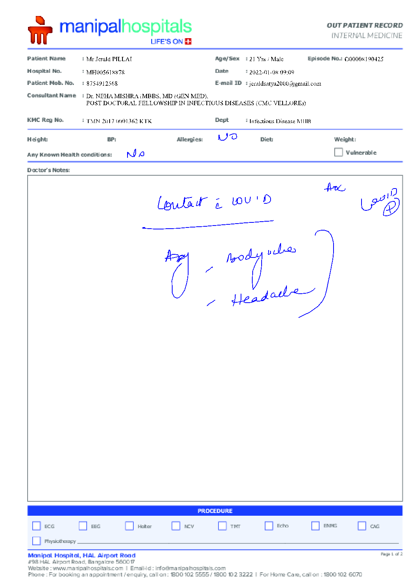
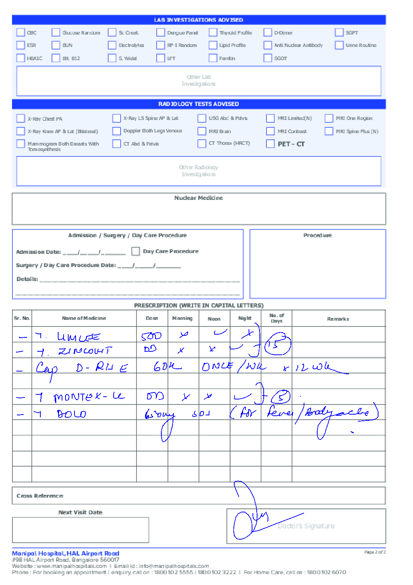

Mr Jerald PILLAI 21 Yrs / Male MH005618878 2022-01-08 09:09

O00008190425

8754912568 jeraldsatya2000@gmail.com

Dr. NEHA MISHRA (MBBS, MD (GEN MED), POST DOCTORAL FELLOWSHIP IN INFECTIOUS DISEASES (CMC VELLORE))

TMN 2017 0001362 KTK Infectious Disease MHB

